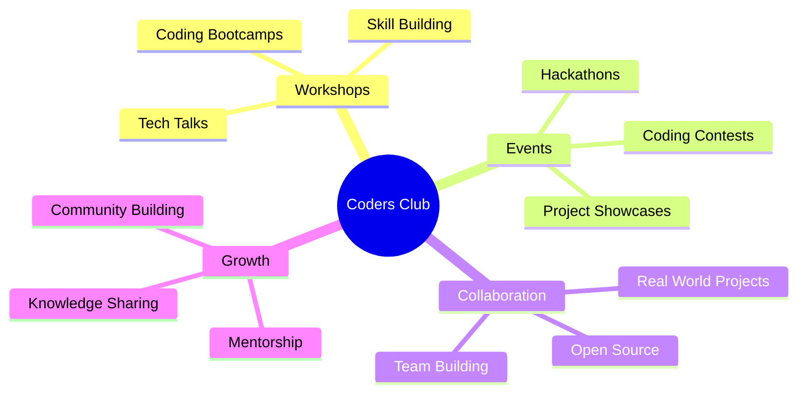

# 👨‍💻 Coders Club - IEDC Sahrdaya 👩‍💻

---

## 🎯 About Us

We are the **official Coders Club of IEDC Sahrdaya** — a vibrant community of passionate developers, tech enthusiasts, and innovators who believe in the power of collaboration and continuous learning!

🌟 **Our Mission**: To create a thriving ecosystem where ideas transform into reality through code, creativity, and community support.

 

---

## 🛠️ What We Do

### 🚀 Our Core Activities

| Activity                     | Description                                              | Impact                 |
| ---------------------------- | -------------------------------------------------------- | ---------------------- |
| 💻 **Workshops & Bootcamps** | Interactive coding sessions covering latest technologies | 500+ students trained  |
| 🏆 **Hackathons & Contests** | 48-hour coding marathons and competitive programming     | 20+ events organized   |
| 🚀 **Project Development**   | Real-world applications and open-source contributions    | 15+ active projects    |
| 🤝 **Collaborations**        | Partnerships with tech companies and other clubs         | 10+ partnerships       |
| 📚 **Mentorship Program**    | Senior-junior developer mentoring system                 | 100+ mentees supported |

---

## 🌟 Our Main Project

### 🎯 Current Project

| Project                    | Description                                                                  | Tech Stack                                                                                                                                                                                     | Status                                                  |
| -------------------------- | ---------------------------------------------------------------------------- | ---------------------------------------------------------------------------------------------------------------------------------------------------------------------------------------------- | ------------------------------------------------------- |
| **🌐 Coders Club Website** | Official website showcasing club activities, events, and member achievements |   |  |

---

## 🧑‍💼 Leadership Team

| Role              | Name         | GitHub                                     | Expertise                      |
| ----------------- | ------------ | ------------------------------------------ | ------------------------------ |
| 👨‍💻 **Lead**    | Aaron Thomas | [@arxhr007](https://github.com/arxhr007)   | Full-Stack Development, DevOps |
| 👨‍💻 **Co-Lead** | Alexo Mathew | [@alexo-007](https://github.com/alexo-007) | Frontend Development, UI/UX    |

---

## 📲 Connect With Us

---

## 🎯 Join Our Community

### 📋 **Submit Your GitHub Project for Coders Club**

Got an amazing project you want to showcase? We'd love to see it!

> 🎓 Whether you're a **fresher** or an **alum**, it doesn't matter — anyone from our college community can submit their projects.

#### ✅ Here's how it works:

1. 📝 Submit your project through our [Google Form](https://docs.google.com/forms/d/e/1FAIpQLSdk-rxkto8IA5Gd4v6YyLdBQIWZ_RTKddMalwd8cddrVtmmWQ/viewform?usp=dialog)
2. ✅ We'll review and add it to our GitHub organization
3. 🌐 Top projects will be **featured on our website**
4. 🏆 You and your teammates will get full credit
5. 📲 We'll contact you via **WhatsApp** for updates and collaboration
6. 🎫 Submitting a valid project gives you **official membership** to Coders Club!

Let's build together. Submit your code and be part of our community revolution!

---

## 🤝 Contributing & Open Source

### 🌟 How to Contribute

1. **🔍 Explore** our repositories and find projects that interest you
2. **📋 Check** the issues section for open tasks
3. **🍜 Fork** the repository and create your feature branch
4. **✨ Make** your amazing contributions
5. **🔄 Submit** a pull request for review

### 📋 Contribution Guidelines

* 📝 Follow our coding standards and documentation
* 🧪 Write tests for new features
* 💬 Engage with the community through issues and discussions
* 🎨 Maintain code quality and best practices

---

### 🌟 *Made with ❤️ by the Coders Club Community*

